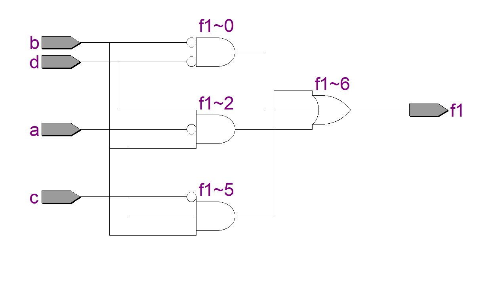
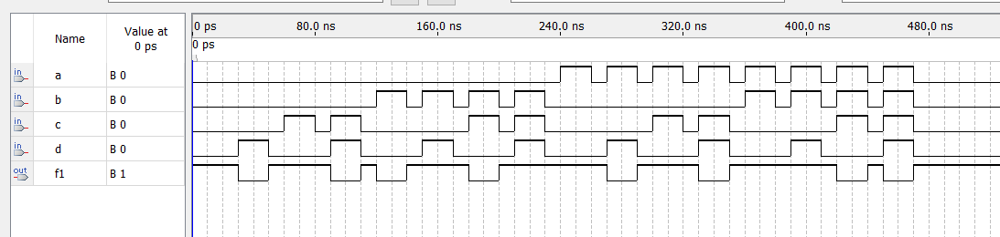
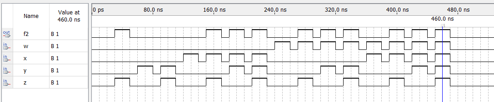

# Experiment--02-Implementation-of-combinational-logic
Implementation of combinational logic gates
 
## AIM:
To implement the given logic function verify its operation in Quartus using Verilog programming.
 F1= A’B’C’D’+AC’D’+B’CD’+A’BCD+BC’D
F2=xy’z+x’y’z+w’xy+wx’y+wxy
 
 
 
## Equipments Required:
## Hardware – 
PCs, Cyclone II , USB flasher
## Software – 
Quartus prime
## Procedure:
1.The input and output variables are allocated with letter symbols.

2.The exact truth table that defines the required relationships between inputs and outputs is derived.

3.The simplified Boolean function is obtained from each output.

4.The logic diagram is drawn.
## Program:

Program to implement the given logic function and to verify its operations in quartus using Verilog programming.
### Developed by: Gumma Dileep Kumar
### RegisterNumber:212222240032
 ```python
 module combinational(a,b,c,d,f1);
input a,b,c,d;
output f1;
assign f1 = (~b&~d) | (~a&b&d) | (a&b&~c);
endmodule
module combinational(w,x,y,z,f2);
input w,x,y,z;
output f2;
assign f2 = (x&y)|(w&y)|(~y&z);
endmodule
``` 

## Output:
## RTL



## Timing Diagram




## Result:
Thus the given logic functions are implemented using  and their operations are verified using Verilog programming.
